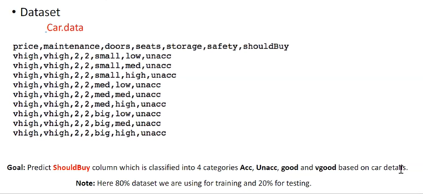
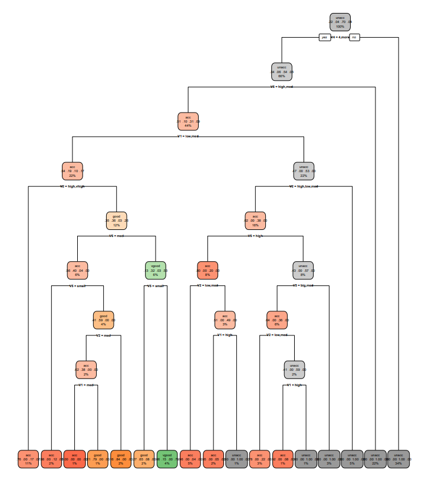
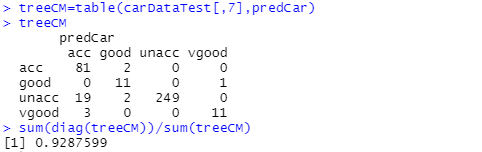

# Executive Summary
In this analysis, I tried to classify the car data and help users to have a decision for car purchasing. I tranded the data using different classification algorithms and tune the parameters to predict the acceptibility of a car. Please refer to R script for the details of code.

# About the Data

Columns 
•	Price – It refers to the range of price(Very high, High, Medium, Low). 
•	Maintenance – It refers to standard of maintenance level (Very high, High, Medium, Low). 
•	Doors – The number of doors for a car. 
•	Seats – Number of seats for a car 
•	Storage – It refers to the size of storage a car (Small, Big, Medium). 
•	Safety - It refers to the saftey of a car (Small, Big, Medium)
•	Should buy - Acceptibility of buying a car(Accurate, Unaccurate, Good, Verygood)

# Data Modeling
I chose 80% data for train, and rest 20% to be tested.
The data is trained using rpart in R script

# Data Prediction & # Decision Tree
After training model, I can now predict the acceptibility of cars using the 20% of data set.

You can see the result of decision make tree as below.

# Confusion Matrix/ Prove the accuracy
You can finally check the accuracy of data using confusion matrix.

