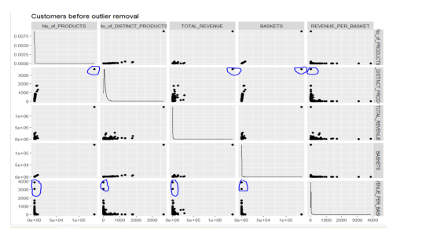

# Executive Summary

This report is to show analysed data for the sales transaction of customers for an online retail store with an objective to perform segmentations:
•	The customers falling into same segment have similar purchasing patterns as below table.

I have considered top 2000 raws and customers. Studying and understanding these segments will help the reviewrs of this report to design and implement their promotional and marketing strategies in a better way. 

# Summary result of Customer Segmentation:

# About the data
I have tried to analyse sales transaction data for an online retail store for transactions between 10th January 2011 and 9th September 2011. 

Table Name – OnlineRetail

Following are the data columns available in input data in original version: - 

•	Invoice No – It refers to unique receipt number generated for every sale transaction. 
•	Stock Code – It refers to unique alpha numeric code for every product. 
•	Description – It provides the name and brief description about the product. 
•	Quantity – Number of units purchased of a product. 
•	Invoice Date – It captures the date for every sale transaction. 
•	Unit Price – It refers to price for each unit of product. 
•	Customer ID – Unique number generated for every customer. 
•	Country – Country of residence of the customer. 
•	Invoice Date Time – It captures the date and time for every sale transaction. 

Data Summary

Total number of records – 541909 
Number of distinct products - 3940 
Number of distinct customers – 4373 
Number of distinct countries – 38 

Please refer to 'dataset.csv' for more details. (The data set is after cleanedd and secelcted from MySQL database using SQL query)  
Selected features 

# Data Cleaning and Outlier Removal

After analysing customer data, I removed NULL value using SQL queries. 
Now, I plotted the data distribution for every feature (using ggpair), to visualise the outliers in them (if any): 

I could additionally remove the rows with ‘Number of distinct Product’ is higher than 1000 based on boxplot as shown below.  
Customer ID 17841, 14911, 14096, 12748 are detected based on the filter. Those customers may buy more than 1000 different items, but comparably other customers buy much less. 

# Cluster Analysis
After the outliers are removed from the table and the data is normalized, I ploted an elbow graph to determine the optimal number of clusters between 1 and 50 for determining K value of K-Mean. As I can see from the below graph there is a curve at around 6 and 7 so the value of k is either 6 or 7. 

•	Customer elbow chart 

# Cluster Profiling
Once the number of clusters has been set and clarified, two approaches can be performed: Characteristic profiling and differential profiling.  
Characteristics profiling involves either determining a single data point that best represents the entire cluster or using the centroid to describe the average characteristics of data points in the cluster.  
Differential profiling is a supervised process where the cluster labels are combined with the existing data to determine what characteristics best explain the differences in the profiles.  
I tried to focus on Characteristic profiling by analyzing the centroid for each cluster and identifying determining characteristics for membership using K-mean in R script. 

•	Customer Clusters Overview and Summary 
 
 

